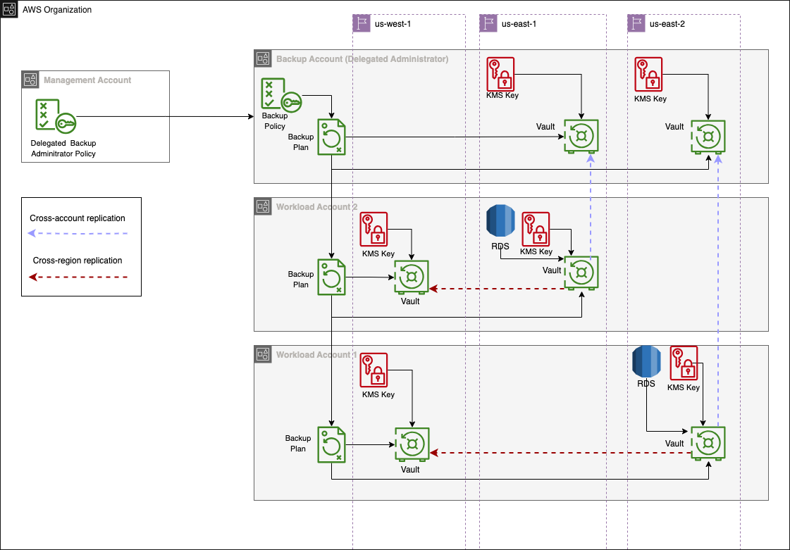

This set of backup modules can be used together to setup automated and centralised backup for all resources across an Organization.

These modules can help setup and enable a delegated backup administrator in an organization, and assigin a secondary backup region for each target resource region. 

All backups are taken in the target resource AWS account. A copy of the backup is then copied to another AWS account / the backup account to achieve cross-account backup retention, while another copy of the backup is replicated to a secondary region to achieve cross-region backup retention.



## Example

The configuration below shows a sample implementation of an organization wide backup policy targeting all resources within the organization with a resource tag `Backup=True`. 

Backups will be sucessfull only in accounts that have a backup-selection role and a backup vault (per target region).

The example will create two organization backup policies to target resources in two regions `us-east-1` and `us-east-2`. The secondary backup region for both policies will be `us-west-1`.


```terraform
 # Terraform module to manage the Organization backup policy in management account
 module "backup-organization-policy" {
   source    = "github.com/thoughtbot/flightdeck//aws/backup/backup-organization-policy?ref=VERSION"

   providers = { aws = aws.management }

   delegate_account_id = 0123456789
 }

# Terraform module to manage the Central Backup policy in the delegated backup account
module "central-backup-policy" {
   source    = "github.com/thoughtbot/flightdeck//aws/backup/central-backup-policy?ref=VERSION"

   providers = { aws = aws.delegate_backup_account }

   for_each = {
    for idx, region_set in local.target_regions :
    idx => region_set
   }

   name                       = "organization-backup-policy"
   backup_cron_schedule       = "cron(0 2 * * ? *)"  # Triggers by 2 AM daily (UTC)
   backup_selection_role_name = "backup-selection-role"
   vault_name                 = "user-backup-vault"
   backup_selection_tags = {
     Backup = ["true"]
   }
   delegate_account_id = var.delegate_account_id

   target_resource_region = each.value.target_resource_region
   secondary_vault_region = each.value.secondary_vault_region

   depends_on = [
     module.backup-organization-policy # If using a delegated backup setup
   ]
 }

# Backup vaults for each account / region meant to store a backup
 module "workload-account-vault-ue1" {
   source    = "github.com/thoughtbot/flightdeck//aws/backup/backup-vault?ref=VERSION"

   providers = { aws = aws.workload_account_ue1 }

   vault_name = local.vault_name
 }

 module "workload-account-vault-ue2" {
   source    = "github.com/thoughtbot/flightdeck//aws/backup/backup-vault?ref=VERSION"

   providers = { aws = aws.workload_account_ue2 }

   vault_name = local.vault_name
 }

 module "backup-account-vault-uw1" {
   source    = "github.com/thoughtbot/flightdeck//aws/backup/backup-vault?ref=VERSION"

   providers = { aws = aws.backup_account_uw1 }

   vault_name = local.vault_name
 }

 locals {
    vault_name = "user-backup-vault"
 }

# Backup selection roles across all target resource accounts.
module "workload_account_backup_selection_role" {
  source    = "./modules/backup-selection-role"
  providers = { aws = aws.workload_account_ue1 }

  backup_selection_role_name = local.backup_selection_role_name
}

module "backup_account_backup_selection_role" {
  source    = "./modules/backup-selection-role"
  providers = { aws = aws.backup_account_uw1 }

  backup_selection_role_name = local.backup_selection_role_name
}


locals {
  backup_selection_role_name = "backup-selection-role"
}
```

### Granting permissions to the management account.

The `backup-organization-policy` module will require permissions in the management account to the delegated backup account a delegated backup administrator. You may create an IAM role using the provided IAM policy below.

```terraform
    {
        "Version": "2012-10-17",
        "Statement": [
            {
                "Sid": "RegisterDelegatedAdmin",
                "Action": [
                    "organizations:RegisterDelegatedAdministrator"
                ],
                "Effect": "Allow",
                "Resource": "*"
            },
            {
                "Sid": "UpdateAwsBackupGlobalSetting",
                "Action": [
                    "backup:UpdateGlobalSettings"
                ],
                "Effect": "Allow",
                "Resource": "*"
            },
            {
                "Sid": "ManageAwsOrganizationResourcePolicy",
                "Action": [
                    "organizations:PutResourcePolicy",
                    "organizations:DeleteResourcePolicy"
                ],
                "Effect": "Allow",
                "Resource": "*"
            },
            {
                "Sid": "DescribeAwsOrganizationResources",
                "Action": [
                    "organizations:Describe*",
                    "organizations:List*"
                ],
                "Effect": "Allow",
                "Resource": "*"
            }
        ]
}
```

You may then use the created IAM role as a provider for the `backup-organization-policy`  terraform module 

<!-- BEGIN_TF_DOCS -->
## Requirements

| Name | Version |
|------|---------|
| <a name="requirement_terraform"></a> [terraform](#requirement\_terraform) | >= 0.14.0 |
| <a name="requirement_aws"></a> [aws](#requirement\_aws) | ~> 5.0 |
<!-- END_TF_DOCS -->