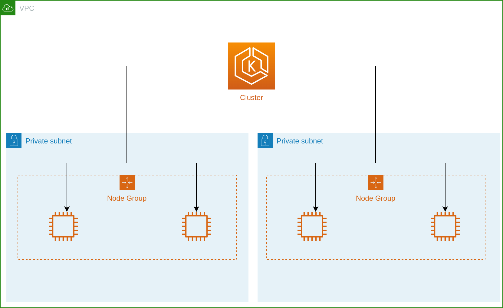

# AWS Cluster

Creates a Kubernetes cluster capable of running the Flightdeck platform using
Terraform and EKS. A different node group is created for each availability zone
so that node counts will grow equally in each availability zone and so that
nodes will be able to reliably attach EBS volumes. An [OIDC
provider](./modules/k8s-oidc-provider) is configured to enable [IRSA].



The module will look up VPC subnets for the cluster using the cluster name. The
VPC and subnets must be tagged following the conventions of the Kubernetes AWS
cloud provider:

| Tag                             | Value  | Add to              |
| ------------------------------- | ------ | ------------------- |
| kubernetes.io/role/internal-elb | 1      | Private subnets     |
| kubernetes.io/role/elb          | 1      | Public subnets      |
| kubernetes.io/cluster/NAME      | shared | VPC and all subnets |

You can quickly create a compatible network using the [network module]. If
you're bringing your own VPC, you must tag resources as documented above before
creating your cluster.

[network module]: ../network/README.md
[irsa]: https://docs.aws.amazon.com/emr/latest/EMR-on-EKS-DevelopmentGuide/setting-up-enable-IAM.html

## Example

```terraform
module "cluster" {
  source = "github.com/thoughtbot/flightdeck//aws/cluster?ref=v0.4.0"

  # Unique name for this EKS cluster.
  name = "example-production-v1"

  # Version of Kubernetes for this cluster. Must be supported by EKS.
  k8s_version = "1.21"

  node_groups = {
    # You need at least one node group definition.
    default = {
      instance_types = ["t3.large"]
      max_size       = 30
      min_size       = 2
    }

    # You can include extra node groups if you want more than one type of node.
    m5_2xlarge = {
      instance_types = ["m5.2xlarge"]
      max_size       = 30
      min_size       = 2
    }
  }

  # Any tags you want to apply to all created resources.
  tags = { Module = "cluster/production-v1" }
}
```

<!-- BEGIN_TF_DOCS -->
## Requirements

| Name | Version |
|------|---------|
| <a name="requirement_terraform"></a> [terraform](#requirement\_terraform) | >= 0.13.0 |
| <a name="requirement_aws"></a> [aws](#requirement\_aws) | ~> 4.0 |

## Providers

| Name | Version |
|------|---------|
| <a name="provider_aws"></a> [aws](#provider\_aws) | ~> 4.0 |

## Modules

| Name | Source | Version |
|------|--------|---------|
| <a name="module_aws_k8s_oidc_provider"></a> [aws\_k8s\_oidc\_provider](#module\_aws\_k8s\_oidc\_provider) | ./modules/k8s-oidc-provider | n/a |
| <a name="module_cluster_name"></a> [cluster\_name](#module\_cluster\_name) | ../cluster-name | n/a |
| <a name="module_eks_cluster"></a> [eks\_cluster](#module\_eks\_cluster) | ./modules/eks-cluster | n/a |
| <a name="module_network"></a> [network](#module\_network) | ../network-data | n/a |
| <a name="module_node_groups"></a> [node\_groups](#module\_node\_groups) | ./modules/eks-node-group | n/a |
| <a name="module_node_role"></a> [node\_role](#module\_node\_role) | ./modules/eks-node-role | n/a |

## Resources

| Name | Type |
|------|------|
| [aws_ssm_parameter.node_role_arn](https://registry.terraform.io/providers/hashicorp/aws/latest/docs/resources/ssm_parameter) | resource |
| [aws_ssm_parameter.oidc_issuer](https://registry.terraform.io/providers/hashicorp/aws/latest/docs/resources/ssm_parameter) | resource |
| [aws_subnet.private](https://registry.terraform.io/providers/hashicorp/aws/latest/docs/data-sources/subnet) | data source |

## Inputs

| Name | Description | Type | Default | Required |
|------|-------------|------|---------|:--------:|
| <a name="input_enabled_cluster_log_types"></a> [enabled\_cluster\_log\_types](#input\_enabled\_cluster\_log\_types) | Which EKS control plane log types to enable | `list(string)` | `[]` | no |
| <a name="input_k8s_version"></a> [k8s\_version](#input\_k8s\_version) | Kubernetes version to deploy | `string` | n/a | yes |
| <a name="input_log_retention_in_days"></a> [log\_retention\_in\_days](#input\_log\_retention\_in\_days) | How many days until control plane logs are purged | `number` | `7` | no |
| <a name="input_name"></a> [name](#input\_name) | Name for this EKS cluster | `string` | n/a | yes |
| <a name="input_namespace"></a> [namespace](#input\_namespace) | Prefix to be applied to created resources | `list(string)` | `[]` | no |
| <a name="input_node_groups"></a> [node\_groups](#input\_node\_groups) | Node groups to create in this cluster | <pre>map(object({<br>    capacity_type  = optional(string, "ON_DEMAND")<br>    instance_types = list(string),<br>    max_size       = number<br>    min_size       = number<br>  }))</pre> | n/a | yes |
| <a name="input_tags"></a> [tags](#input\_tags) | Tags to be applied to all created resources | `map(string)` | `{}` | no |

## Outputs

| Name | Description |
|------|-------------|
| <a name="output_cluster_name"></a> [cluster\_name](#output\_cluster\_name) | Full ame of the created cluster |
| <a name="output_node_role_arn_parameter"></a> [node\_role\_arn\_parameter](#output\_node\_role\_arn\_parameter) | SSM parameter which contains the ARN of the IAM role for nodes |
| <a name="output_oidc_issuer_parameter"></a> [oidc\_issuer\_parameter](#output\_oidc\_issuer\_parameter) | SSM parameter which contains the OIDC issuer URL |
<!-- END_TF_DOCS -->