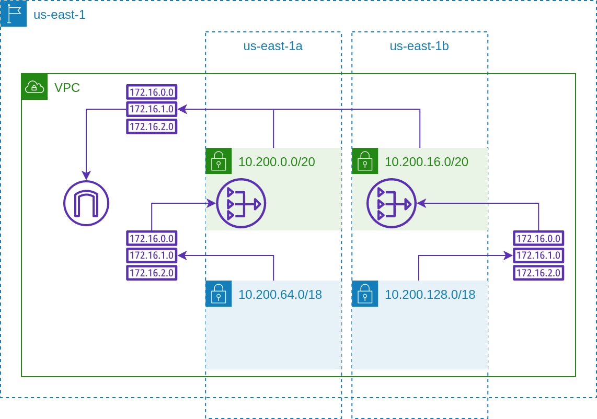

# AWS Network

Provisions an AWS VPC and other components required for an EKS cluster,
including public and private subnets, route tables, routes, and NAT gateways. We
recommend using separate VPCs for production and pre-production.



## Example

```terraform
module "network" {
  source = "github.com/thoughtbot/flightdeck//aws/network?ref=v0.4.0"

  # Unique name for the Name tag displayed in AWS Management Console.
  name                   = "example-production"

  # Names of Kubernetes clusters allowed to use this network.
  # Clusters should be listed here before they're created.
  cluster_names          = ["example-production-v1"]

  # Primary CIDR block for the VPC.
  # We recommend this doesn't overlap with any other VPCs in your organization.
  vpc_cidr_block         = "10.200.0.0/16"

  # Availability zones in which NAT gateways should be created.
  # You can list a single zone if you only want one NAT gateway.
  nat_availability_zones = ["us-east-1a", "us-east-1b"]

  # Availability zones for which private subnets should be created.
  # At least two subnets are recommended. Must be a subset of the VPC CIDR.
  private_subnet_cidr_blocks = {
    "us-east-1a" = "10.200.64.0/18"
    "us-east-1b" = "10.200.128.0/18"
  }

  # Availability zones for which public subnets should be created.
  # At least two subnets are recommended. Must be a subset of the VPC CIDR.
  public_subnet_cidr_blocks = {
    "us-east-1a" = "10.200.0.0/20"
    "us-east-1b" = "10.200.16.0/20"
  }

  # Any extra tags you want to apply to all created resources.
  tags = {
    Module = "vpc/production"
  }
}
```

<!-- BEGIN_TF_DOCS -->
## Requirements

| Name | Version |
|------|---------|
| <a name="requirement_terraform"></a> [terraform](#requirement\_terraform) | >= 0.14.8 |
| <a name="requirement_aws"></a> [aws](#requirement\_aws) | 5.74.0 |

## Providers

| Name | Version |
|------|---------|
| <a name="provider_aws"></a> [aws](#provider\_aws) | 5.74.0 |

## Modules

| Name | Source | Version |
|------|--------|---------|
| <a name="module_nat_gateway"></a> [nat\_gateway](#module\_nat\_gateway) | ./modules/nat-gateway | n/a |
| <a name="module_private_subnet_routes"></a> [private\_subnet\_routes](#module\_private\_subnet\_routes) | ./modules/private-subnet-routes | n/a |
| <a name="module_private_subnets"></a> [private\_subnets](#module\_private\_subnets) | ./modules/private-subnets | n/a |
| <a name="module_public_subnet_routes"></a> [public\_subnet\_routes](#module\_public\_subnet\_routes) | ./modules/public-subnet-routes | n/a |
| <a name="module_public_subnets"></a> [public\_subnets](#module\_public\_subnets) | ./modules/public-subnets | n/a |
| <a name="module_vpc"></a> [vpc](#module\_vpc) | ./modules/vpc | n/a |

## Resources

| Name | Type |
|------|------|
| [aws_internet_gateway.this](https://registry.terraform.io/providers/hashicorp/aws/5.74.0/docs/resources/internet_gateway) | resource |
| [aws_vpc.this](https://registry.terraform.io/providers/hashicorp/aws/5.74.0/docs/data-sources/vpc) | data source |

## Inputs

| Name | Description | Type | Default | Required |
|------|-------------|------|---------|:--------:|
| <a name="input_cluster_names"></a> [cluster\_names](#input\_cluster\_names) | List of clusters which run in this network | `list(string)` | `[]` | no |
| <a name="input_create_internet_gateway"></a> [create\_internet\_gateway](#input\_create\_internet\_gateway) | Set to false to disable creation of an internet gateway | `bool` | `true` | no |
| <a name="input_create_nat_gateways"></a> [create\_nat\_gateways](#input\_create\_nat\_gateways) | Set to false to disable creation of NAT gateways | `bool` | `true` | no |
| <a name="input_create_vpc"></a> [create\_vpc](#input\_create\_vpc) | Set to false to disable creation of the VPC | `bool` | `true` | no |
| <a name="input_enable_flow_logs"></a> [enable\_flow\_logs](#input\_enable\_flow\_logs) | Set to true to enable VPC flow logs | `bool` | `false` | no |
| <a name="input_enable_ipv6"></a> [enable\_ipv6](#input\_enable\_ipv6) | Set to false to disable IPV6 | `bool` | `false` | no |
| <a name="input_enable_public_ip_on_launch"></a> [enable\_public\_ip\_on\_launch](#input\_enable\_public\_ip\_on\_launch) | Set to true to auto-assign IP addresses in public subnets | `bool` | `false` | no |
| <a name="input_name"></a> [name](#input\_name) | Name for this network | `string` | n/a | yes |
| <a name="input_namespace"></a> [namespace](#input\_namespace) | Prefix to be applied to created resources | `list(string)` | `[]` | no |
| <a name="input_nat_availability_zones"></a> [nat\_availability\_zones](#input\_nat\_availability\_zones) | Availability zones in which NAT should be provided | `list(string)` | n/a | yes |
| <a name="input_private_subnet_cidr_blocks"></a> [private\_subnet\_cidr\_blocks](#input\_private\_subnet\_cidr\_blocks) | CIDR block for each availability zone | `map(string)` | n/a | yes |
| <a name="input_private_subnet_tags"></a> [private\_subnet\_tags](#input\_private\_subnet\_tags) | Tags to be applied to private subnets | `map(string)` | `{}` | no |
| <a name="input_public_subnet_cidr_blocks"></a> [public\_subnet\_cidr\_blocks](#input\_public\_subnet\_cidr\_blocks) | CIDR block for each availability zone | `map(string)` | n/a | yes |
| <a name="input_public_subnet_tags"></a> [public\_subnet\_tags](#input\_public\_subnet\_tags) | Tags to be applied to public subnets | `map(string)` | `{}` | no |
| <a name="input_tags"></a> [tags](#input\_tags) | Tags to be applied to all created resources | `map(string)` | `{}` | no |
| <a name="input_vpc_cidr_block"></a> [vpc\_cidr\_block](#input\_vpc\_cidr\_block) | CIDR block to be used for the VPC, such as 10.0.0.0/16 | `string` | n/a | yes |
| <a name="input_vpc_tags"></a> [vpc\_tags](#input\_vpc\_tags) | Tags to be applied to the VPC | `map(string)` | `{}` | no |

## Outputs

| Name | Description |
|------|-------------|
| <a name="output_cluster_names"></a> [cluster\_names](#output\_cluster\_names) | List of clusters which run in this network |
| <a name="output_nat_ip_addresses"></a> [nat\_ip\_addresses](#output\_nat\_ip\_addresses) | List of IP addresses created for NAT gateways |
| <a name="output_vpc_id"></a> [vpc\_id](#output\_vpc\_id) | ID of the AWS VPC |
<!-- END_TF_DOCS -->