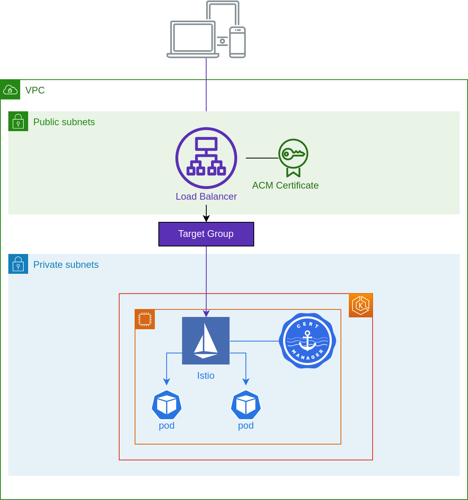
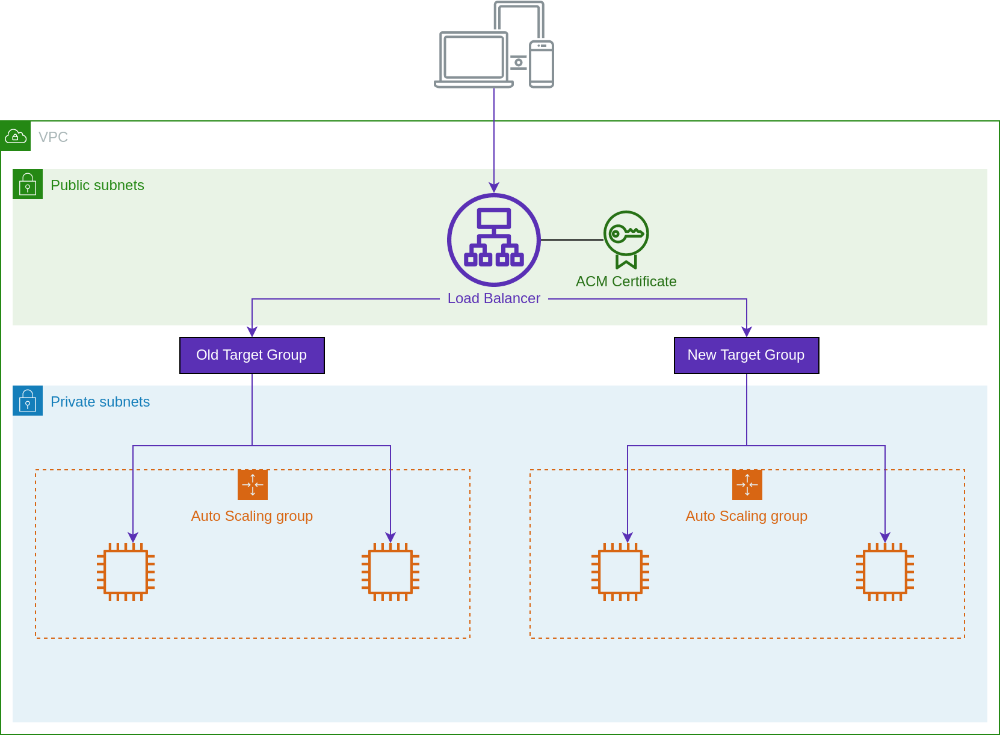

# Target Groups

Generates target group definitions for forwarding traffic to Flightdeck
clusters.

You can use this with [ALB Ingress] or another module to create a load balancer
with target groups.



## Example

```terraform
module "target_groups" {
  providers = {
  source = "git@github.com:thoughtbot/flightdeck//aws/target-groups"

  # Names of clusters to target from this load balancer.
  # Clusters should be added here before they're created.
  cluster_names = ["example-production-v1"]
}

module "ingress" {
  providers = {
    # You can use different provider instances when using multiple accounts.
    aws.cluster = aws
    aws.route53 = aws
  }

  source = "git@github.com:thoughtbot/terraform-alb-ingress.git?ref=v0.4.0"

  # Pass the target group definitions from the previous step
  target_groups = module.target_groups.by_cluster

  # Unique name for the Application Load Balancer
  name = "example-production-ingress"

  # Name of a Route 53 hosted zone to which records should be added.
  # You can leave this out if you're managing DNS and certificates separately.
  # If provided, DNS aliases and ACM certificate validation are automatic.
  hosted_zone_name    = "example.com"

  # Primary domain name for the ACM certificate.
  primary_domain_name = "example.com"

  # Any other domains which should be routed to this load balancer.
  # These domains will have DNS aliases and will be listed on the certificate.
  alternative_domain_names = ["www.example.com"]

  # Any extra tags you want to apply to all created resources.
  tags = { Module = "ingress/production" }
}
```

## Migrations

If you're migrating to a new Flightdeck cluster (or migrating to Flightdeck from
a non-Flightdeck deployment) you can use multiple target groups to slowly shift
traffic from the old deployment to the new cluster.



First add a new target group for the new cluster with a weight of zero:

```terraform
module "target_groups" {
  cluster_names = ["example-production-v1", "example-production-v2"]
}

module "ingress" {
  target_groups = module.target_groups.by_cluster

  target_group_weights = {
    example-production-v1 = 100
    example-production-v2 = 0
  }
}
```

Once applications are deployed to the new cluster, add a small weight:

```terraform
module "target_groups" {
  cluster_names = ["example-production-v1", "example-production-v2"]
}

module "ingress" {
  target_groups = module.target_groups.by_cluster

  target_group_weights = {
    example-production-v1 = 95
    example-production-v2 = 5
  }
}
```

You can gradually increase the weight and reapply until all traffic targets the
new cluster. Then, de-provision the old cluster and remove its target group:

```terraform
module "target_groups" {
  cluster_names = ["example-production-v2"]
}

module "ingress" {
  target_groups = module.target_groups.by_cluster

  target_group_weights = {
    example-production-v2 = 100
  }
}
```

[alb ingress]: https://github.com/thoughtbot/terraform-alb-ingress

<!-- BEGIN_TF_DOCS -->
## Requirements

| Name | Version |
|------|---------|
| <a name="requirement_terraform"></a> [terraform](#requirement\_terraform) | >= 0.13.0 |
| <a name="requirement_aws"></a> [aws](#requirement\_aws) | ~> 3.0 |

## Modules

| Name | Source | Version |
|------|--------|---------|
| <a name="module_cluster_name"></a> [cluster\_name](#module\_cluster\_name) | ../cluster-name | n/a |
| <a name="module_network"></a> [network](#module\_network) | ../network-data | n/a |

## Inputs

| Name | Description | Type | Default | Required |
|------|-------------|------|---------|:--------:|
| <a name="input_cluster_names"></a> [cluster\_names](#input\_cluster\_names) | List of clusters that this ingress stack will forward to | `list(string)` | n/a | yes |
| <a name="input_network_tags"></a> [network\_tags](#input\_network\_tags) | Additional tags for finding the AWS VPC and subnets | `map(string)` | `{}` | no |

## Outputs

| Name | Description |
|------|-------------|
| <a name="output_by_cluster"></a> [by\_cluster](#output\_by\_cluster) | Target group definition for each cluster |
| <a name="output_subnet_ids"></a> [subnet\_ids](#output\_subnet\_ids) | Subnets in which target groups should be created |
| <a name="output_vpc_id"></a> [vpc\_id](#output\_vpc\_id) | VPC in which target groups should be created |
<!-- END_TF_DOCS -->